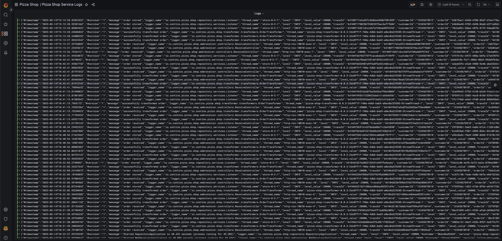
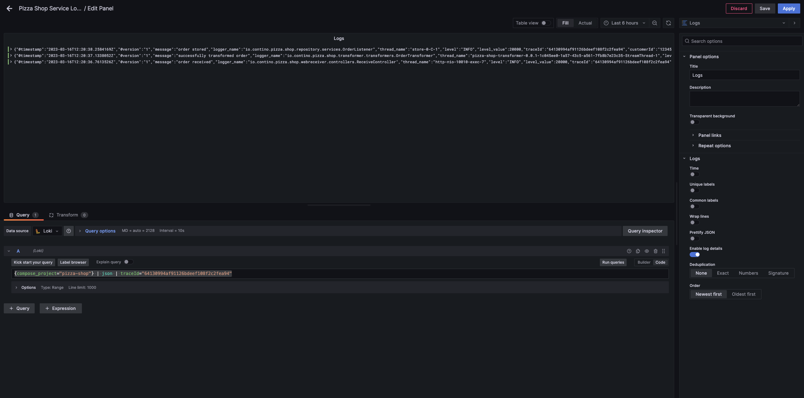
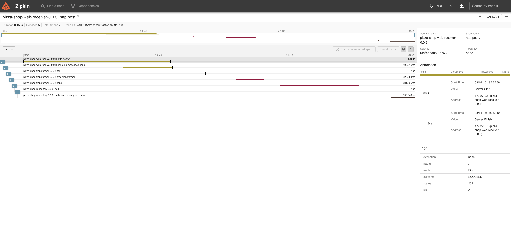
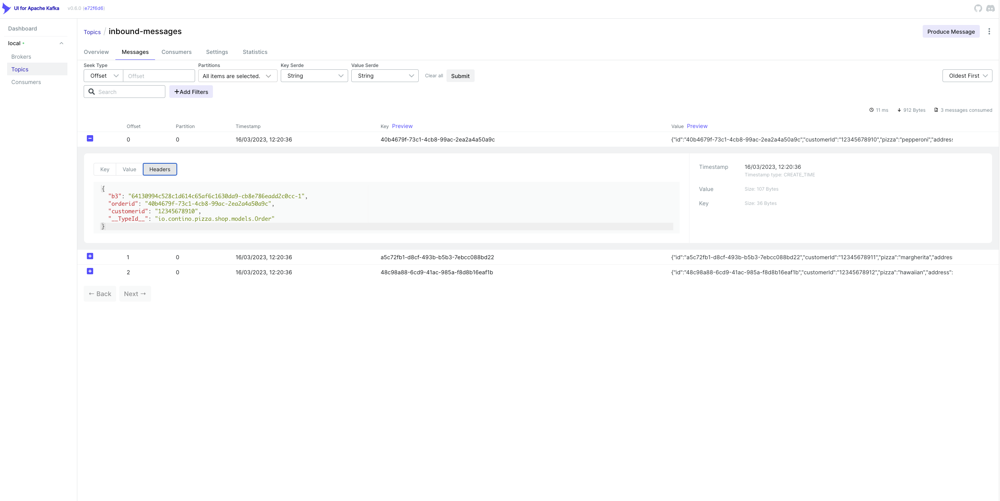

# Distributed Logging and Tracing in Spring Boot 3 and Kafka

In recent years, microservices architecture has gained widespread popularity as a way to develop complex software systems. The concept of breaking down large monolithic applications into smaller, independently deployable services has allowed developers to increase agility by decoupling feature delivery. However, with the benefits of microservices come many challenges, especially when it comes to tracing the flow of data and requests between services. Distributed tracing is a technique that helps developers understand the behavior of complex systems by providing visibility into the path of a request as it moves through various services. This article will focus on distributed tracing in Kafka microservices. Kafka has become a popular choice for building distributed systems due to its ability to handle large volumes of data and its support for real-time data processing. What follows is a detailed example of how to wire Micrometer and Brave in Spring Boot 3 Kafka applications to enable distributed tracing and log correlation.

## A Quick Word About Spring Cloud Sleuth

Until recently, Spring Boot tracing functionality was provided by the Spring Cloud Sleuth project (https://github.com/spring-cloud/spring-cloud-sleuth). As of Spring Boot 3, this functionality has been moved to the Micrometer Tracing https://micrometer.io/docs/tracing project to consolidate the work.

## Micrometer

Micrometer (https://micrometer.io/) is a project that aims to provide a vendor-neutral application metrics facade. Micrometer Tracing sits within the Micrometer suite and is a simple facade over the most popular tracing libraries, providing a framework for developers to instrument JVM-based applications without vendor lock-in.

## Only The Brave 

Brave (https://github.com/openzipkin/brave) is a distributed tracing instrumentation library. Brave typically intercepts requests to gather timing information and propagates metadata to help correlate trace contexts.


## The Sample Application

The sample application for this article is available on GitHub (https://github.com/contino/pizza-shop). The application is broken into 3 distinct services, there is a web-reciever that accepts pizza orders as JSON payloads and places them onto a Kafka topic, a transformer that uses Kafka Streams (https://docs.confluent.io/platform/current/streams/index.html) to augment the order information with the customer's address and a repository application which places orders into a local memory store. 

To enable tracing using Micrometer and Brave, the applications include the following dependencies

```xml
<dependency>
    <groupId>org.springframework.boot</groupId>
    <artifactId>spring-boot-starter-actuator</artifactId>
</dependency>
...
<dependency>
    <groupId>io.micrometer</groupId>
    <artifactId>micrometer-tracing</artifactId>
</dependency>
<dependency>
    <groupId>io.micrometer</groupId>
    <artifactId>micrometer-tracing-bridge-brave</artifactId>
</dependency>
```

As messages flow throw the system, any log messages written by the services will automatically be enhanced with a unique tracing identifier (`traceId`), the customer's identifier (`customerId`), and a unique order identifier (`orderId`). While the tracing identifier is provided automatically by brave, the other fields are configured as "Baggage" fields (see https://github.com/openzipkin/brave/blob/master/brave/RATIONALE.md#baggage). The following class performs the necessary setup for these baggage fields.

```java
public class TracingConfig {

    @Bean(name = "orderId")
    public BaggageField orderId() {
        return BaggageField.create("orderId");
    }

    @Bean(name = "customerId")
    public BaggageField customerId() {
        return BaggageField.create("customerId");
    }

    @Bean
    public CurrentTraceContext.ScopeDecorator mdcScopeDecorator(@Qualifier("orderId") BaggageField orderId, @Qualifier("customerId") BaggageField customerId) {
        return MDCScopeDecorator.newBuilder().clear()
            .add(CorrelationScopeConfig.SingleCorrelationField.newBuilder(orderId).flushOnUpdate().build())
            .add(CorrelationScopeConfig.SingleCorrelationField.newBuilder(customerId).flushOnUpdate().build())
            .build();
    }
}
```

This class is included in the tracing library and is imported into each service as follows

```java
@SpringBootApplication
@AutoConfigureObservability
@Import({TracingConfig.class}) // Required to setup Baggage fields
public class WebReceiverApplication {
    public static void main(String[] args) {
        SpringApplication.run(WebReceiverApplication.class, args);
    }
}
```

Further configuration is then provided in the common `application-tracing.yaml` which is imported into each service's `application.yaml` file.

```yaml
logging:
  config: classpath:logback-spring.xml

management:
  tracing:
    enabled: true
    propagation:
      type: b3 # see https://github.com/openzipkin/b3-propagation
    sampling:
      probability: 1.0 # trace every request - not recommended for production :)
    baggage:
      correlation:
        enabled: true
        fields: orderId, customerId
      remote-fields: orderId, customerId
```

The above configuration enables tracing, sets the propagation type to b3 (Zipkin format), informs the system to sample all requests, and sets the `orderId` and `customerId` fields as both local and remote (meaning they will be transported between services as header metadata).

The common logback-spring.xml configuration file is as follows 

```xml
<configuration>
    <springProperty scope="context" name="service" source="spring.application.name"/>
    <property scope="context" name="hostname" value="${HOSTNAME}"/>
    <appender name="console" class="ch.qos.logback.core.ConsoleAppender">
        <encoder class="net.logstash.logback.encoder.LogstashEncoder">
            <timeZone>UTC</timeZone>
            <includeMdcKeyName>traceId</includeMdcKeyName>
            <includeMdcKeyName>orderId</includeMdcKeyName>
            <includeMdcKeyName>customerId</includeMdcKeyName>
            <includeContext>false</includeContext>
            <customFields>{"hostname":"${HOSTNAME}","service":"${service}"}</customFields>
        </encoder>
    </appender>
    <root level="info">
        <appender-ref ref="console"/>
    </root>
</configuration>
```

The baggage field value population is performed by the Controller class in the web receiver project. These values are set here once and propagated between other services transparently by the framework.

```java
@RestController
@RequiredArgsConstructor
@Slf4j
public class ReceiveController {

    @NonNull
    private final Sender sender;

    @NonNull
    private final IdGenerator idGenerator;

    @NonNull
    @Qualifier("orderId")
    private final BaggageField orderIdBaggageField;

    @NonNull
    @Qualifier("customerId")
    private final BaggageField customerIdBaggageField;

    @PostMapping("${service.api.path}")
    @ResponseStatus(HttpStatus.ACCEPTED)
    void sendMessage(@RequestBody Order request) {
        var order = request.withId(idGenerator.generate());
        orderIdBaggageField.updateValue(order.id());
        customerIdBaggageField.updateValue(order.customerId());
        sender.send(order);
        log.info("order received");
    }
}
```
The last piece of the puzzle in the web receiver is to set observation to enabled on the Spring `KafkaTemplate` instance that will be used by the application to post messages on the topic 

```java
@Bean
KafkaTemplate<String, Order> kafkaTemplate() {
    KafkaTemplate<String, Order> kafkaTemplate = new KafkaTemplate<>(producerFactory());
    kafkaTemplate.setObservationEnabled(true);
    return kafkaTemplate;
}
```

Moving over to the transformer service, as well as importing the `TracingConfig` class with common spring and logback config, there are some other necessary additions we need to make to a Kafka streams application to enable the tracing functionality. 

```java
@Bean
KafkaStreamsTracing kafkaStreamsTracing(Tracing tracing) {
    return KafkaStreamsTracing.create(tracing);
}

@Bean
KafkaStreams kafkaStreams(TopologyService topologyService, KafkaStreamsTracing kafkaStreamsTracing) {
    Properties props = new Properties();
    props.put(ProducerConfig.BOOTSTRAP_SERVERS_CONFIG, bootstrapAddress);
    props.put(StreamsConfig.APPLICATION_ID_CONFIG, applicationName);
    props.put(StreamsConfig.DEFAULT_KEY_SERDE_CLASS_CONFIG, Serdes.String().getClass());
    props.put(StreamsConfig.DEFAULT_VALUE_SERDE_CLASS_CONFIG, JsonSerde.class);
    props.put(JsonDeserializer.TRUSTED_PACKAGES, "*");
    KafkaStreams kafkaStreams = kafkaStreamsTracing.kafkaStreams(topologyService.topology(), props);
    Runtime.getRuntime().addShutdownHook(new Thread(kafkaStreams::close));
    kafkaStreams.start();
    return kafkaStreams;
}
```

The configuration above instantiates an instance of the KafkaStreamsTracing class which we can use to create a wrapped instance of the KafkaStreams class. This wrapped instance automatically generates Kafka `poll` and `send` spans and send them as part of the trace context to the Zipkin server. 

To enable log correlation on Kafka Streams Transformation and Processor implementations the current solution is unfortunately a little invasive. Currently, it is necessary to wrap each transformation or process operation in a call to KafkaStreamsTracing as below. 

```java
public Topology topology() {
    var streamsBuilder = new StreamsBuilder();
    KStream<String, Order> messageStream = streamsBuilder.stream(serviceProperties.inbound().topic().topicName());

    messageStream.transformValues(kafkaStreamsTracing.valueTransformer(OrderTransformer.class.getSimpleName(), transformer))
            .to(serviceProperties.outbound().topic().topicName());

    return streamsBuilder.build();
}
```

Without the wrapping operation, any log messages written by the Transformer or Processor instance will not include the correlation information (traceId, customerId, etc...). Further information on the above can be found here https://github.com/openzipkin/brave/blob/master/instrumentation/kafka-streams/README.md. This is further complicated by the fact that the current Kstream's `process` and `transform` methods are being deprecated in favor of a more condensed API (see https://cwiki.apache.org/confluence/display/KAFKA/KIP-820%3A+Extend+KStream+process+with+new+Processor+API). A request for an update to Brave's KafkaStreamsTracing class has been raised (see https://github.com/openzipkin/brave/issues/1365).

The final service in the application flow (which also includes the aforementioned import of the `TracingConfig` class and `application-tracing.yaml`) is relatively straightforward to configure. The service makes use of Spring's `@KafkaListener` annotation to trigger an operation to save the incoming order to a repository.

```java
@KafkaListener(id = "${service.topic.listener-id}", topics = "${service.topic.topic-name}")
public void insertOrder(Order order) {
    orderRepository.insertOrder(order);
    log.info("order stored");
}
```

To enable trace propagation it is necessary only to add a tracing `PostProcessor` to the instance of Spring's `DefaultKafkaConsumerFactory` and set ObservationEnabled to true.

```java
@Bean
ConcurrentKafkaListenerContainerFactory<String, String> kafkaListenerContainerFactory(KafkaTracing kafkaTracing) {
    Map<String, Object> props = new HashMap<>();
    props.put(ConsumerConfig.BOOTSTRAP_SERVERS_CONFIG, bootstrapAddress);
    props.put(ConsumerConfig.KEY_DESERIALIZER_CLASS_CONFIG, StringDeserializer.class);
    props.put(ConsumerConfig.VALUE_DESERIALIZER_CLASS_CONFIG, JsonDeserializer.class);
    props.put(JsonDeserializer.TRUSTED_PACKAGES, "*");
    ConcurrentKafkaListenerContainerFactory<String, String> factory = new ConcurrentKafkaListenerContainerFactory<>();
    ConsumerFactory<String, String> consumerFactory = new DefaultKafkaConsumerFactory<>(props);
    consumerFactory.addPostProcessor(kafkaTracing::consumer);
    factory.setConsumerFactory(consumerFactory);
    factory.getContainerProperties().setObservationEnabled(true);
    return factory;
}

@Bean
KafkaTracing kafkaTracing(Tracing tracing) {
    return KafkaTracing.create(tracing);
}
```

## Running The Application Stack

A docker-compose file that includes Kafka, Zookeeper, Zipkin, Grafana, and the applications themselves, can be found in the root of the repository. To launch the stack simply run the following command in the root directory.

```bash
make up
```

This will install the required Loki Docker plugin (to enable log aggregation in Grafana), build and install the applications to the local Docker repository, launch the stack, and wait for the health check URL to respond. Once up, some traffic can be generated by running 

```bash
make test
```

To view, the logs navigate to http://localhost:3000/dashboards, log in with the credentials "admin" / "admin" and click on "Pizza Shop" / "Pizza Shop Service Logs". Once there you should see something similar to the image below.



The logs can be filtered by clicking "Logs" / "Edit" at the top of the page and changing the query to that below (remember to change the traceId to one already provided in the logs).

```sql
{compose_project="pizza-shop"} | json | traceId="641355c5ff56aff737d0a8b5e775b626"
```


To view traces in Zipkin navigate to http://localhost:9411/zipkin and enter one of the traceIds from the logs in the top right-hand corner of the screen and hit enter. You should see something similar to below.



To view the Kafka headers navigate to http://localhost:9093/ui/clusters/local/all-topics/inbound-messages/messages and click on one of the messages shown in the list. Click the "Headers" tab to view the "b3", "orderid" and "customerid" header information that has been automatically attached to the message by the framework.



## Wrapping up

In conclusion, distributed tracing is an essential tool for organizations implementing microservices architecture. The numerous benefits of distributed tracing include improved visibility into the system, faster problem resolution, and better end-to-end performance analysis. Distributed tracing enables developers and operations teams to track requests as they move across multiple services, providing insight into the behaviour and performance of individual components and the system as a whole.

The abstraction layers provided by Spring Boot, Micrometer and Brave make the implementation of distributed tracing functionality relatively simple and enables consistency whether the services are communicating via HTTP or a Messaging system such as Kafka. 

