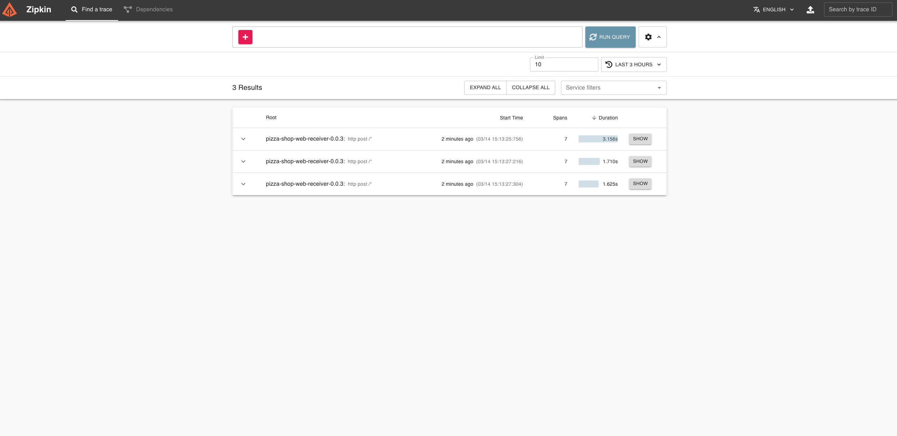

# Pizza Shop Demo Application

Pizza shop demo application to demonstrate the use of Micrometer and Brave for tracing and log correlation in Spring Boot 3.

## Run the stack

```bash
make up
```

## Make Some Requests

```bash
make test
```

## View The Logs

Navigate to http://localhost:3000/dashboards, login with "admin" / "admin" and click on "Pizza Shop" / "Pizza Shop Service Logs". If you have generated some traffic then you should see some logs.


## View Traces in Zipkin

Navigate to http://localhost:9411/zipkin/ and click "Run Query", if you have generated some traffic then you should see some traces.



click show to see the trace


## Shutdown the stack

```bash
make down
```
